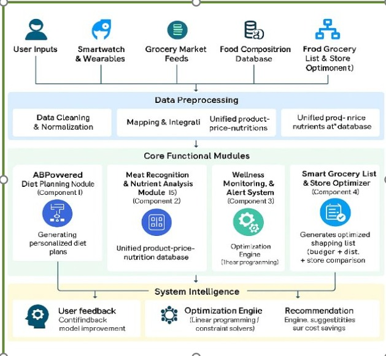
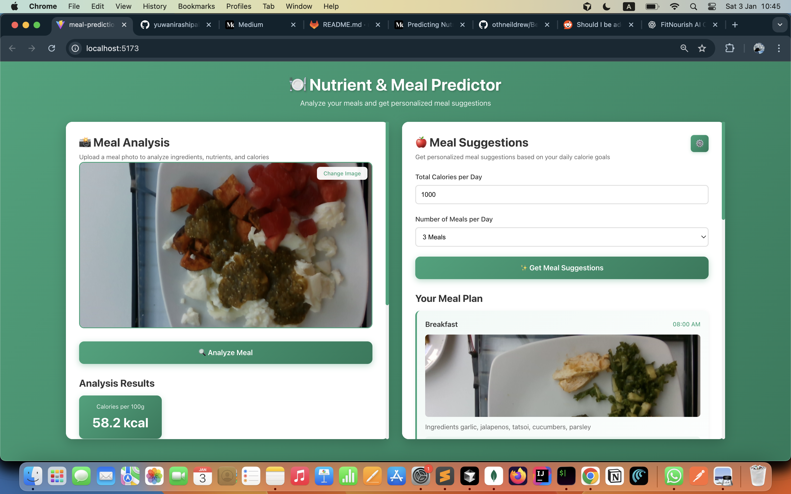
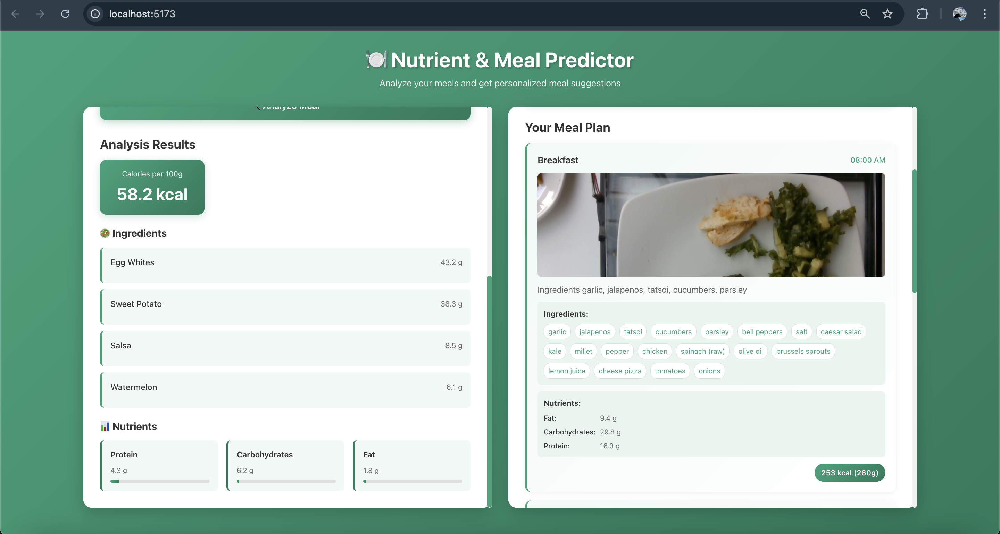

# FitNourish AI

An intelligent, AI-powered nutrition assistant that delivers personalized meal planning, food analysis, and real-time health monitoring.

## 📋 Table of Contents

- [Project Overview](#project-overview)
- [Architecture](#architecture)
- [Key Features](#key-features)
- [Installation](#installation)
- [Project Dependencies](#project-dependencies)
- [Usage](#usage)

## 🎯 Project Overview

FitNourish AI is an intelligent, AI-powered nutrition assistant designed to address poor dietary habits and the lack of personalized nutrition guidance in existing health applications. Many current diet and fitness apps rely on static recommendations and fail to adapt to users' real-time health data, leading to ineffective diet planning and long-term health issues.

To overcome these limitations, FitNourish AI integrates machine learning, computer vision, and real-time wellness monitoring to deliver personalized, dynamic, and data-driven dietary advice. The system analyzes user profiles, health goals, dietary preferences, and smartwatch biometrics to generate customized meal plans and proactive health alerts.

The platform also incorporates image processing to analyze food photos and suggest suitable meal options, as well as a smart grocery optimizer that creates cost-effective shopping lists aligned with the user's diet plan. By continuously monitoring lifestyle habits and health indicators, FitNourish AI adapts recommendations in real time, ensuring a holistic and user-centric nutrition solution.

### Project Summary

**Problem Addressed:** Poor dietary habits and lack of personalized, real-time nutrition advice in existing applications

**Research Gap:** Absence of intelligent, adaptive, and holistic nutrition systems that utilize real-time health data

**Proposed Solution:** An AI-driven nutrition assistant that dynamically personalizes diet plans and health recommendations

**Main Objective:** To help users manage health conditions and achieve fitness goals through personalized meal planning, health monitoring, and timely alerts

## 🏗️ Architecture

The system architecture of FitNourish AI is illustrated below:

## ✨ Key Features

- **Personalized meal planning** using machine learning
- **Smartwatch-based biometric** and wellness monitoring
- **Food image analysis** using computer vision
- **Budget-friendly grocery** recommendations
- **Real-time health alerts** and habit tracking
- **Ingredient detection** with ML confidence scores
- **Nutrient prediction** from meal images
- **Calorie tracking** and meal optimization

## 🚀 Installation

### Prerequisites

- **Python** 3.8 or higher
- **Node.js** v20.12.2 or higher
- **npm** 10.5.0 or higher

## 📦 Project Dependencies

<!-- Project dependencies content will be added here -->

## 💡 Usage

​
<!-- Add other member feature usages here-->
🧩 Component 1 – AI-Powered Multi-Disease Adaptive Nutrition & Personalized Health Optimization

This component of FitNourish.AI focuses on delivering personalized nutrition recommendations by combining user health profiles, lifestyle data, and machine-learning predictions. It is designed as a mobile-first interface suitable for real-world deployment and academic demonstration (PP1).

🔹 Interface Overview

<table align="center">
  <tr>
    <td align="center">
      
        
      <b>FitNourish.AI – Nutrition Profile Input & Prediction Result Interface</b>
    </td>
  </tr>
</table>

The mobile interface consists of two primary screens:

Nutrition Profile Input Interface

Nutrition Prediction Result Interface

These interfaces guide users through a simple and intuitive workflow—from data entry to AI-generated nutrition insights.

🧑‍⚕️ Nutrition Profile Input Interface

This screen collects essential user health and activity information required for accurate nutrition prediction.

📋 User Inputs

Personal Information

Age

Gender (Male / Female)

Height (cm)

Weight (kg)

Nutrition Goal

Maintain weight

Lose weight

Gain weight

Health Conditions

Diabetes (Yes / No)

Hypertension (Yes / No)

Daily Activity Metrics

Steps per day

Active minutes

Calories burned during activity

🎨 Smart Validation & User Experience (UX)

Input validation ensures realistic and medically meaningful values
(e.g., step count limits, numeric constraints)

Toggle buttons and dropdowns are used instead of free-text inputs

A green-themed UI aligns with the FitNourish.AI brand identity

Mobile-friendly layout enhances usability and clarity

⌚ Smartwatch Data Integration (Demo Logic)

During first-time setup, users manually enter activity data

In a real-world deployment, this data is designed to be:

Automatically fetched from smartwatch or fitness tracker APIs

Periodically updated to keep nutrition recommendations current

📊 Nutrition Prediction Result Interface

Once the user clicks “Predict & Save”, the validated data is sent to the backend AI system for processing.

🤖 AI-Generated Outputs

Daily Calorie Requirement (kcal/day)

Protein Requirement (g/day)

Carbohydrate Requirement (g/day)

Fat Requirement (g/day)

⚙️ Model & Backend

Backend Framework: FastAPI (REST API)

Machine Learning Model: Trained Random Forest Regression Model

Database: PostgreSQL (stores prediction history and user records)

⭐ Key Highlights

Results are displayed using a clear, card-based layout

Macro-nutrients are visually separated for easy interpretation

Prediction results can be saved and viewed later via the History section

Designed for scalability with future health data integrations

🔁 End-to-End Workflow

User opens the FitNourish.AI mobile application

Health and activity data are entered or synced from a smartwatch

Data is validated on the frontend

Backend AI model processes the input

Personalized nutrition targets are generated

Results are displayed and stored for future reference

🎯 Purpose of This Component

This component demonstrates:

AI-driven personalization in healthcare and nutrition

Integration of frontend, backend, machine learning, and database layers

Readiness for real-world wearable device integration

A professional, user-centric mobile application design

### Component 2 - AI-powered Dynamic Meal Generator and Visual Ingredient Identifier

<table>
<tr>
<td width="50%">
  
</td>
<td width="50%">
  
</td>
</tr>
</table>

#### Meal Analysis

1. Click on the upload area in the left panel
2. Select a meal image from your device
3. Click "Analyze Meal" button
4. View the results:
   - **Ingredients:** List of detected ingredients with ML confidence scores
   - **Nutrients:** Nutritional breakdown with amounts and percentages
   - **Calories:** Calorie content per 100g

#### Meal Suggestions

1. Enter your daily calorie target (e.g., 2000 calories)
2. Select the number of meals per day (2, 3, or 4)
3. Optionally customize settings:
   - Click the settings icon (⚙️) to adjust:
     - Calorie distribution ratios across meals
     - Target macro ratios (carbohydrates, proteins, fats)
4. Click "Get Meal Suggestions"
5. Browse through the suggested meals with:
   - Meal images
   - Ingredient lists
   - Nutritional information
   - Calorie content

